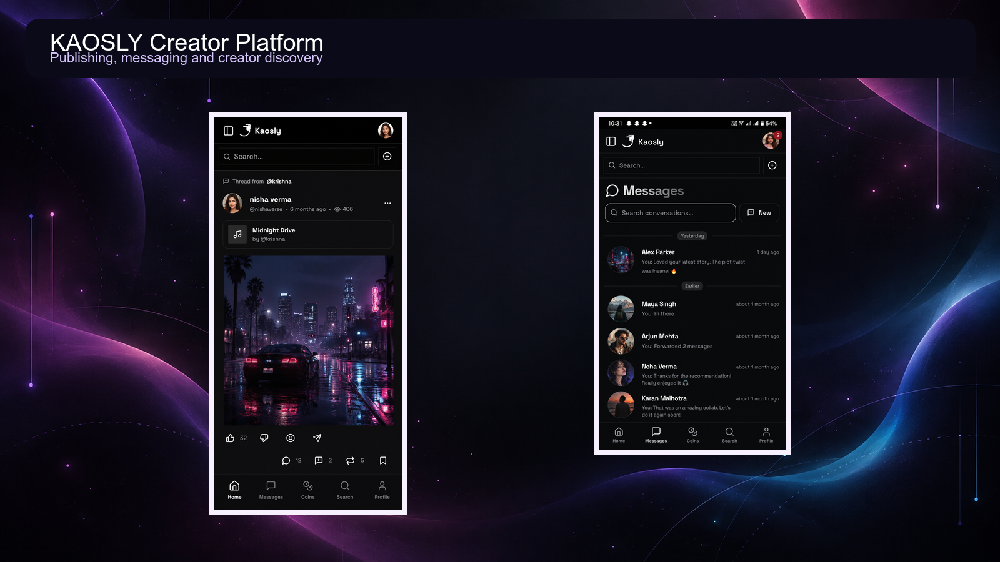
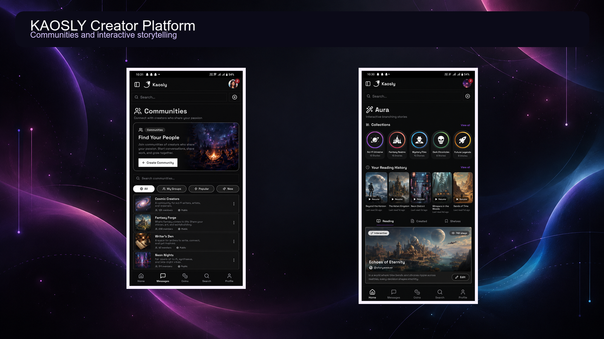

# KAOSLY — Product Case Study

**India-focused, creator-first social platform combining publishing, short-form media, interactive stories, communities, messaging and creator monetisation.**

> This repository is a presentation-only case study. The production source code is private and owned by Chaotic Tech Pvt Ltd.

## Product vision

Creators commonly rely on separate platforms for posts, short videos, communities, audio, messaging and monetisation. KAOSLY was designed as an integrated ecosystem where those experiences can work together under one identity.

## Core product areas

| Area | Purpose |
| --- | --- |
| Feed and posts | Publish and discover creator content |
| Drifts | Short-form vertical media |
| Aura | Interactive story and visual-node experiences |
| Communities | Interest-based clubs and discussions |
| Tunes | Audio posts and profile music |
| Messaging | Direct communication between users |
| Creator economy | Subscriptions, paid content and digital monetisation workflows |
| Live experiences | Real-time creator interaction |

## My role

As founder and product developer, I worked across:

- Product architecture and feature planning
- Next.js application development
- Firebase authentication, database, storage and hosting
- Media-heavy user experiences
- Progressive Web App and Android Trusted Web Activity delivery
- Payment and creator-economy integrations
- Deployment, indexing, permissions and production troubleshooting

## Technology

Next.js · React · TypeScript · Firebase · Firestore · Cloud Functions · Firebase Storage · PWA · Android TWA · Cashfree integrations

## Interface preview

The following images show a controlled product demonstration. They contain sample creator content and do not expose production configuration, customer records or payment data.

### Publishing and messaging

KAOSLY brings discovery, creator posts and direct conversations into one mobile-first experience.

### Communities and Aura

Communities support interest-based participation, while Aura provides a dedicated interactive-story experience.

## Engineering challenges

- Designing multiple content formats without fragmenting the navigation
- Managing authentication, Firestore rules and media permissions
- Delivering a PWA through both the web and Android
- Handling large media workflows within Firebase's operational constraints
- Keeping creator, community and messaging experiences connected
- Integrating monetisation without exposing payment-sensitive logic

## Privacy and source availability

The production repository is intentionally private. This case study excludes credentials, production customer data, security rules, internal documents and proprietary implementation details.
